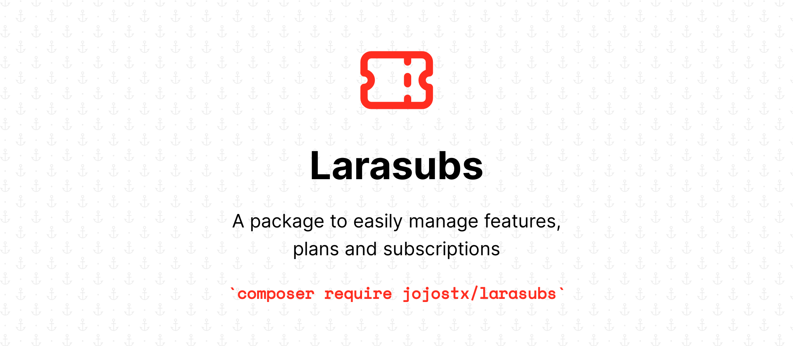

<p align="center">
    
</p>

<p align="center">
<a href="https://packagist.org/packages/lucasdotvin/laravel-soulbscription">

</a>
<a href="https://github.com/jojostx/larasubs/actions?query=workflow%3Arun-tests+branch%3Amain">

</a>
<a href="https://github.com/jojostx/larasubs/actions?query=workflow%3Afix-code-style+branch%3Amain">

</a>
<a href="https://packagist.org/packages/lucasdotvin/laravel-soulbscription">

</a>
</p>

## About

This package provides a straightforward interface to handle subscriptions and features consumption.

## Installation

You can install the package via composer:

```bash
composer require jojostx/larasubs
```

## Usage

To start using it, you just have to add the given trait to your `User` model (or any entity you want to have subscriptions):

```php
<?php
namespace App\Models;
use Jojostx\Larasubs\Models\Concerns\HasSubscriptions;
class User
{
    use HasSubscriptions;
}
```

And that's it!

### Setting Plans Up

First things first, you have to define the plans you'll offer. In the example below, we are creating two plans.

```php
<?php
namespace Database\Seeders;
use Illuminate\Database\Seeder;
use Jojostx\Larasubs\Enums\IntervalType;
use Jojostx\Larasubs\Models\Models\Plan;

class PlanSeeder extends Seeder
{
    public function run()
    {
        $deployMinutes = Plan::create([
            'name'                    => 'silver',
            'description'             => 'Plan for medium businesses',
            'active'                  => true,
            'price'                   => 100000 // price in the lowest currency value (kobo)
            'currency'                => 'NGN',
            'interval'                => 6,
            'interval_type'           => IntervalType::YEAR,
            'trial_interval'          => 1,
            'trial_interval_type'     => IntervalType::MONTH,
            'grace_interval'          => 1,
            'grace_interval_type'     => IntervalType::MONTH
        ]);

        $customDomain = Plan::create([
            'name'                    => 'gold',
            'description'             => 'Plan for large businesses',
            'active'                  => true,
            'price'                   => 10000000 // price in the lowest currency value (kobo)
            'currency'                => 'NGN',
            'interval'                => 6,
            'interval_type'           => IntervalType::YEAR,
            'trial_interval'          => 1,
            'trial_interval_type'     => IntervalType::MONTH,
            'grace_interval'          => 1,
            'grace_interval_type'     => IntervalType::MONTH
        ]);
    }
}
```

Everything here is quite simple, but it is worth to emphasize: by receiving the interval options above, the two plans are defined as yearly with a 1 month trial period and grace period.

#### Grace Period

You can define a grace grace for each plan, so your users will not loose access to their features immediately when the subscription ends:
